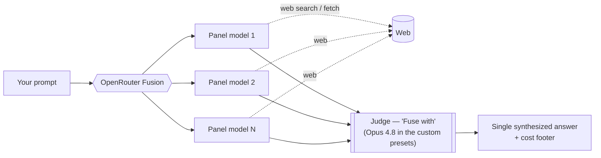
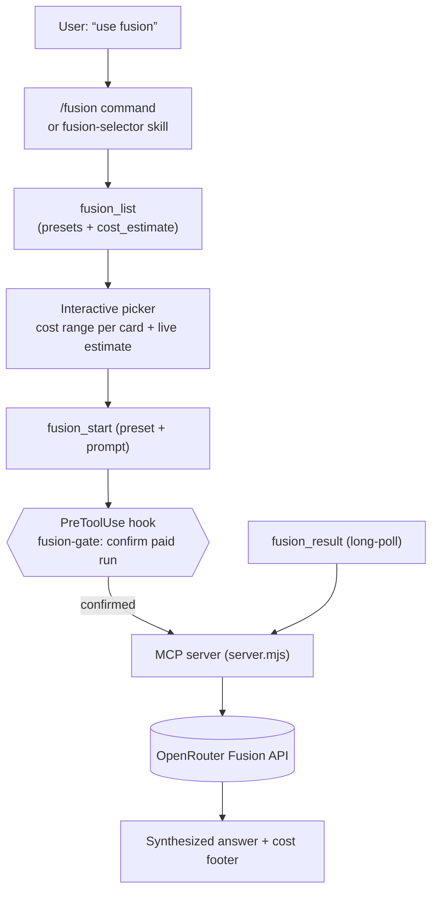

# OpenRouter Fusion — MCP server

[](https://modelcontextprotocol.io)
[](https://nodejs.org)
[](LICENSE)

A small [MCP](https://modelcontextprotocol.io) server that exposes **OpenRouter Fusion**
(multi-model deliberation) to any MCP client — MCPHub, Claude Code, Claude Desktop, claude.ai, Cursor — for
when you need a *very* good answer. It ships as a **Claude Code plugin** too: MCP server **+** an interactive
preset selector (skill **+** `/fusion` command) **+** a deterministic cost-confirmation hook, all in one install.

> Un petit serveur **MCP** qui expose **OpenRouter Fusion** (délibération multi-modèles) à n'importe quel
> client MCP, pour quand il faut une réponse *vraiment* bonne. Livré aussi comme **plugin Claude Code** :
> serveur MCP **+** sélecteur de preset interactif (skill **+** commande `/fusion`) **+** un hook de
> confirmation de coût déterministe, en une seule installation.

**🇬🇧 [English](#-english) · 🇫🇷 [Français](#-français)**

---

## What is Fusion? / Qu'est-ce que Fusion ?

Fusion turns one prompt into a small **multi-model deliberation**: a **panel** of models answers in parallel
(each with web search/fetch), then a **judge** (the "Fuse with" model) synthesizes consensus, contradictions,
unique insights and blind spots into **one** final answer. It beats any single frontier model on hard
questions — at roughly **4–5× the cost** of a single completion.
Docs: <https://openrouter.ai/docs/guides/features/plugins/fusion> · blog: <https://openrouter.ai/blog/announcements/fusion-beats-frontier/>



---

## 🇬🇧 English

### How the plugin fits together



Four cooperating layers, each a safety net for the one above:

| Layer | File | Role |
|-------|------|------|
| **MCP server** | `server.mjs` | The 3 async tools. Travels with *every* install (npx / plugin / bundle). |
| **Skill** (model-invoked) | `skills/fusion-selector/` | Auto-triggers the list→recommend→pick flow whenever you want Fusion without naming a preset. |
| **Command** | `commands/fusion.md` | Explicit `/fusion` — same flow, with an interactive picker (cost range per preset + live estimate). |
| **Hook** (PreToolUse) | `hooks/fusion-gate.mjs` | Deterministic backstop: confirms **every paid `fusion_start`** (showing the preset), even if the model skips the selector. |

### Tools (v2 — async only)

| Tool | Role |
|------|------|
| `fusion_list` | List configs — `panel`, `judge`, `reasoning_effort`, `temperature`, `max_tool_calls`, `cost_tier`, **`cost_estimate`**. Call it FIRST when the user hasn't named a preset. |
| `fusion_start` | Start a deliberation in the **background**; returns a `job_id` immediately (never times out). |
| `fusion_result` | Long-poll a `job_id` (~45 s/call) → the synthesized answer, or `{status:"running"}` to retry. |

```
fusion_start({ prompt, preset:"research" }) → { job_id }
fusion_result({ job_id }) → answer    (re-call while {status:"running"})
```

The old synchronous wrappers (`fusion_quality` / `fusion_ultra` / `fusion_perso`) were removed — sync calls
were killed by client/proxy timeouts. Everything goes through `fusion_start` + `fusion_result`.

Per-call overrides on `fusion_start`: `preset`, `reasoning_effort`, `temperature`, `analysis_models`,
`judge_model`, `max_tool_calls`, `system`.

### Presets

`quality` and `budget` are **built-in** (OpenRouter's native tabs). The rest are **named custom configs**,
one per environment variable, grounded in OpenRouter's **DRACO** benchmark (100 deep-research tasks) and
community feedback. The judge is **Opus 4.8 everywhere**; `max_tool_calls = 8` everywhere.

| Preset | Panel | Judge | Reasoning | Est. cost/run |
|--------|-------|-------|-----------|---------------|
| `quality` | native OpenRouter "Quality" | Opus 4.8 | high | ~$0.10–0.70 |
| `budget` | native `general-budget` (chosen by OpenRouter) | OpenRouter | medium | ~$0.05–0.30 |
| `research` ⭐ | Opus 4.8 + GPT‑5.5 + Gemini Pro + DeepSeek V4 | Opus 4.8 | high | ~$0.07–1.03 |
| `research-eco` ⭐ | Gemini Flash + Kimi + DeepSeek V4 Pro | Opus 4.8 | high | ~$0.04–0.47 |
| `maths` | GPT‑5.5 + Gemini Pro + DeepSeek V4 + GLM 5.2 | Opus 4.8 | xhigh | ~$0.06–0.82 |
| `medecine` | Opus 4.8 + GPT‑5.5 + Gemini Pro | Opus 4.8 | high | ~$0.07–1.00 |
| `code` | GPT‑5.5 + Opus 4.8 + DeepSeek V4 + GLM 5.2 | Opus 4.8 | high | ~$0.06–0.98 |

- `research` mirrors the DRACO 68.3% config. The #1 (69.0%) uses **Fable**, which is gated on most accounts
  (see *Gotchas*) — add it to the panel if your account has access.
- `research-eco` ≈ the 64.7% config at roughly **half the cost** (cheap panel, Opus judge kept for reliability).
- `code` is for **architecture / review / best-practices**, NOT raw code generation (Fusion isn't a drop-in
  coder — per the OpenRouter blog). For raw code, use a single specialized model.

> **Which presets are active?** `quality` and `budget` work out-of-the-box on *any* install. The custom
> presets (`research`, `research-eco`, `maths`, `medecine`, `code`) need their `OPENROUTER_FUSION_<NAME>`
> env var — **the plugin (install B) ships all five in its `.mcp.json`**, so they're available immediately.
> For a bare `npx`/MCPHub install, paste the values from [`fusion-env-vars.json`](fusion-env-vars.json) into
> the client's `env`. `fusion_list` only ever advertises presets that are actually loaded, so the selector
> won't recommend one that isn't there.

Canonical definitions: [`fusion-presets.json`](fusion-presets.json). Paste-ready env values:
[`fusion-env-vars.json`](fusion-env-vars.json).

### Design choices (the *why*)

- **Judge = Opus 4.8 in every custom preset.** DRACO ranks Opus the best synthesizer, and a *cheap* judge is the #1 cause
  of "fusion failed" (Reddit). Self-fusion (Opus panel → Opus judge) still gains **+6.7 pts** — the lift is in
  the synthesis, not just the panel.
- **Provider-diverse panels.** Different model families surface different blind spots; mixing Anthropic /
  OpenAI / Google / DeepSeek / Z‑AI beats stacking one vendor.
- **Fusion = research & critique, not raw code.** The `code` preset is scoped accordingly.
- **`max_tool_calls` is a ceiling, default 8 (not a floor).** It bounds the panel/judge web loop; unused
  budget is free. ⚠️ Setting it **too low (e.g. 1) starves the Opus judge mid-loop** → it returns **no final
  text** (`content:null`), a wasted paid run. Keep it at the default 8.
- **No `tool_choice:"required"` on the alias form.** Forcing a tool call made the outer model emit a
  `web_search` instead of synthesizing (`content:null` — the widespread "empty Fusion" bug). The
  orchestrator/server-tool form *does* set it (it must invoke the fusion tool).
- **Floating `~…-latest` aliases** (`~anthropic/claude-opus-latest`, `~google/gemini-pro-latest`, …)
  auto-track the newest snapshot and resolve correctly inside the Fusion plugin (verified).

#### Model-availability gotchas (account-specific, live-verified)

| Slug | Result | Fix |
|------|--------|-----|
| `~anthropic/claude-fable-latest` / `anthropic/claude-fable-5` | 404 "not available" (Mythos-gated) | excluded from `research`; add it back if your account has Fable |
| `~openai/gpt-latest` | 400 (alias points at a gated model) | pin `openai/gpt-5.5` (GA) |
| `openai/o3` | 400 (verification required) | dropped from `maths` |

### Cost estimation

`fusion_list` returns a **`cost_estimate`** per preset, computed from **live OpenRouter prices** (cached 1 h):

```json
"cost_estimate": { "low": 0.07, "high": 1.03, "usd_per_prompt_token": 0.0000174 }
```

- `low`/`high` = estimated **USD per run**: floor = little web, ceiling = the full `max_tool_calls` web budget.
  Calibrated so the heavy `research` ceiling ≈ an observed **~$1** run.
- `usd_per_prompt_token` lets a client add the prompt's input cost **live**:
  `est = low + prompt_tokens × usd_per_prompt_token` (… up to `high + …`). It matters mostly for **large**
  prompts.
- It is a deliberately **wide, indicative range — not a quote.** The panel's hidden web/output tokens
  dominate and aren't knowable before the run (a run can even *under-report* its own token `usage` while
  `cost` is much higher).

The `/fusion` picker uses this to show a per-preset range on each card **and** a live estimate that updates as
you type the prompt. There is also a relative `cost_tier` (€/€€/€€€) for a quick glance.

### Configuring — one env var per config

The server scans every `OPENROUTER_FUSION_<NAME>` env var and registers a config named `<name>`
(lowercased; override with a `name` field). The value is the JSON object `{...}`; the parser also tolerates a
`"name":{...}` fragment or a `{"name":{...}}` wrapper.

```
OPENROUTER_FUSION_MATHS  = {"name":"maths","analysis_models":[...],"judge":"~anthropic/claude-opus-latest","reasoning_effort":"xhigh","temperature":null,"max_tool_calls":8,"system":"..."}
OPENROUTER_FUSION_CODE   = {...}
```

Each config carries: `analysis_models` (panel) · `judge` (orchestrator) · `reasoning_effort`
(`xhigh`\|`high`\|`medium`\|`low`\|`minimal`\|`none`, default `high`) · `temperature` (`null` = model default,
or `0–2`) · `max_tool_calls` (1–16, default **8**) · optional `system`.

Other env vars: `OPENROUTER_API_KEY` (an **inference** key with credit) · `OPENROUTER_FUSION_DEFAULT_REASONING`
· `OPENROUTER_FUSION_MAX_TOOL_CALLS` (global web-loop cap, default 8). Legacy `OPENROUTER_FUSION_PRESETS`
(single map) and `OPENROUTER_FUSION_PERSO_CONFIG` are still read for backward-compat.

Diagnostic: `FUSION_DUMP_PRESETS=1 node server.mjs` prints the resolved configs and exits.

### Install

```bash
npm install   # no build step — plain ESM, run with: node server.mjs   (Node ≥ 18 for global fetch)
```

Set your key via the client's `env`, or copy `.env.example` → `.env` (`OPENROUTER_API_KEY=sk-or-...`).

#### A) MCP server only (any client)

```bash
claude mcp add openrouter-fusion -e OPENROUTER_API_KEY=sk-or-... -- npx -y openrouter-fusion-mcp
```

> Bleeding edge: replace `openrouter-fusion-mcp` with `github:tboome33/openrouter-fusion-mcp` to run the
> latest unreleased `master` instead of the published npm version.

You get the 3 tools. The selector behavior **travels with the server via the tool descriptions** — asked to
use Fusion without a named preset, the model is told to call `fusion_list` and make you pick. This is the only
layer that also works on claude.ai / Cursor / other clients.

#### B) As a Claude Code plugin (MCP **+** skill **+** command **+** cost-gate hook)

```
/plugin marketplace add tboome33/openrouter-fusion-mcp
/plugin install openrouter-fusion@tboome33
```

Bundles the full behavior — **everything travels with the plugin**, no per-user config. Set `OPENROUTER_API_KEY`
in your environment first (the plugin's `.mcp.json` reads `${OPENROUTER_API_KEY}`).

> **Why a plugin?** Slash commands and skills do **not** travel with a plain MCP install (only tool
> descriptions do). A plugin bundles the MCP server *together with* its command, skill and hook so a user gets
> the full interactive UX — and the cost gate — in one install.

#### MCPHub (stdio)

```json
{
  "name": "openrouter-fusion",
  "config": {
    "type": "stdio",
    "command": "node",
    "args": ["/absolute/path/to/openrouter-fusion/server.mjs"],
    "env": { "OPENROUTER_API_KEY": "sk-or-...", "OPENROUTER_FUSION_RESEARCH": "{...}" }
  }
}
```

#### One-click `.mcpb` bundle

```bash
npx @anthropic-ai/mcpb pack   # prompts the user for their OpenRouter key on install (user_config)
```

### Examples

```jsonc
{ "prompt": "Explain ridge vs lasso vs elastic net.", "preset": "research" }
{ "prompt": "Differential diagnoses for this case…", "preset": "medecine", "reasoning_effort": "xhigh" }
```

### Notes & troubleshooting

- Model slugs use OpenRouter syntax — pick valid slugs from <https://openrouter.ai/models>.
- **Empty answer / `content:null`** → almost always `tool_choice:"required"` on the alias *or* `max_tool_calls`
  set too low. This server avoids both.
- A tool-set change only shows client-side after the connector reconnects (cached manifest); calls still hit
  the live server.
- Jobs live in memory only. On a server restart, in-flight `job_id`s become `Unknown` — just call
  `fusion_start` again. Finished jobs are pruned after ~30 min.

---

## 🇫🇷 Français

### Comment le plugin s'assemble

Quatre couches qui coopèrent, chacune servant de filet de sécurité à la précédente :

| Couche | Fichier | Rôle |
|--------|---------|------|
| **Serveur MCP** | `server.mjs` | Les 3 tools async. Voyage avec *chaque* installation (npx / plugin / bundle). |
| **Skill** (invoquée par le modèle) | `skills/fusion-selector/` | Déclenche le flux lister→recommander→choisir dès que tu veux Fusion sans nommer de preset. |
| **Commande** | `commands/fusion.md` | `/fusion` explicite — même flux, avec un picker interactif (fourchette de coût par preset + estimation live). |
| **Hook** (PreToolUse) | `hooks/fusion-gate.mjs` | Filet déterministe : confirme **chaque `fusion_start` payant** (en montrant le preset), même si le modèle saute le sélecteur. |

*(Voir les schémas Mermaid en tête de page — ils sont langue-neutres.)*

### Les tools (v2 — async uniquement)

| Tool | Rôle |
|------|------|
| `fusion_list` | Liste les configs — `panel`, `judge`, `reasoning_effort`, `temperature`, `max_tool_calls`, `cost_tier`, **`cost_estimate`**. À appeler EN PREMIER quand l'utilisateur n'a pas nommé de preset. |
| `fusion_start` | Lance une délibération en **arrière-plan** ; renvoie un `job_id` immédiatement (jamais de timeout). |
| `fusion_result` | Long-poll d'un `job_id` (~45 s/appel) → la réponse synthétisée, ou `{status:"running"}` à relancer. |

Les anciens wrappers synchrones (`fusion_quality` / `fusion_ultra` / `fusion_perso`) ont été retirés — les
appels sync étaient tués par les timeouts client/proxy. Tout passe par `fusion_start` + `fusion_result`.
Overrides par appel : `preset`, `reasoning_effort`, `temperature`, `analysis_models`, `judge_model`,
`max_tool_calls`, `system`.

### Presets

`quality` et `budget` sont **natifs** (onglets OpenRouter). Les autres sont des **configs custom nommées**,
une par variable d'env, fondées sur le benchmark **DRACO** d'OpenRouter (100 tâches de deep-research) + les
retours communautaires. Juge = **Opus 4.8 partout** ; `max_tool_calls = 8` partout.

| Preset | Panel | Juge | Reasoning | Coût estimé/run |
|--------|-------|------|-----------|-----------------|
| `quality` | « Quality » natif OpenRouter | Opus 4.8 | high | ~$0.10–0.70 |
| `budget` | `general-budget` natif (choisi par OpenRouter) | OpenRouter | medium | ~$0.05–0.30 |
| `research` ⭐ | Opus 4.8 + GPT‑5.5 + Gemini Pro + DeepSeek V4 | Opus 4.8 | high | ~$0.07–1.03 |
| `research-eco` ⭐ | Gemini Flash + Kimi + DeepSeek V4 Pro | Opus 4.8 | high | ~$0.04–0.47 |
| `maths` | GPT‑5.5 + Gemini Pro + DeepSeek V4 + GLM 5.2 | Opus 4.8 | xhigh | ~$0.06–0.82 |
| `medecine` | Opus 4.8 + GPT‑5.5 + Gemini Pro | Opus 4.8 | high | ~$0.07–1.00 |
| `code` | GPT‑5.5 + Opus 4.8 + DeepSeek V4 + GLM 5.2 | Opus 4.8 | high | ~$0.06–0.98 |

- `research` = la config DRACO 68.3 %. La #1 (69,0 %) utilise **Fable**, restreint sur la plupart des comptes
  (cf *Gotchas*) — ajoute-le au panel si ton compte y a accès.
- `research-eco` ≈ la config 64,7 % à environ **moitié prix** (panel éco, juge Opus conservé pour la fiabilité).
- `code` vise l'**architecture / la revue / les best-practices**, PAS l'écriture de code brut (Fusion n'est pas
  un codeur drop-in — cf blog OpenRouter). Pour du code brut, un seul modèle spécialisé.

> **Quels presets sont actifs ?** `quality` et `budget` marchent out-of-the-box sur *toute* installation.
> Les presets custom (`research`, `research-eco`, `maths`, `medecine`, `code`) nécessitent leur variable
> `OPENROUTER_FUSION_<NOM>` — **le plugin (installation B) embarque les cinq dans son `.mcp.json`**, donc ils
> sont disponibles immédiatement. Pour une installation `npx`/MCPHub nue, colle les valeurs de
> [`fusion-env-vars.json`](fusion-env-vars.json) dans l'`env` du client. `fusion_list` n'annonce que les
> presets réellement chargés, donc le sélecteur n'en recommandera jamais un absent.

Définitions canoniques : [`fusion-presets.json`](fusion-presets.json). Valeurs d'env prêtes :
[`fusion-env-vars.json`](fusion-env-vars.json).

### Choix de conception (le *pourquoi*)

- **Juge = Opus 4.8 dans chaque preset custom.** DRACO classe Opus meilleur synthétiseur, et un juge *bon marché* est la cause
  n°1 des « fusion failed » (Reddit). La self-fusion (panel Opus → juge Opus) gagne quand même **+6,7 pts** —
  le gain est dans la synthèse, pas seulement le panel.
- **Panels multi-providers.** Des familles de modèles différentes révèlent des angles morts différents ;
  mélanger Anthropic / OpenAI / Google / DeepSeek / Z‑AI bat l'empilement d'un seul fournisseur.
- **Fusion = recherche & critique, pas code brut.** Le preset `code` est cadré en conséquence.
- **`max_tool_calls` est un plafond, défaut 8 (pas un plancher).** Il borne la boucle web panel/juge ; le
  budget inutilisé est gratuit. ⚠️ Un cap **trop bas (ex. 1) affame le juge Opus** en pleine boucle → il ne
  rend **aucun texte final** (`content:null`), un run payant gâché. Garde le défaut 8.
- **Pas de `tool_choice:"required"` sur la forme alias.** Forcer un appel d'outil poussait le modèle externe à
  émettre un `web_search` au lieu de synthétiser (`content:null` — le bug « Fusion vide » répandu). La forme
  orchestrateur/server-tool, elle, le met (elle DOIT invoquer le tool fusion).
- **Alias flottants `~…-latest`** (`~anthropic/claude-opus-latest`, `~google/gemini-pro-latest`, …) suivent
  automatiquement le dernier snapshot et résolvent bien dans le plugin Fusion (vérifié).

#### Gotchas de disponibilité (spécifiques au compte, vérifiés en live)

| Slug | Résultat | Fix |
|------|----------|-----|
| `~anthropic/claude-fable-latest` / `anthropic/claude-fable-5` | 404 « not available » (accès Mythos) | exclu de `research` ; remets-le si ton compte a Fable |
| `~openai/gpt-latest` | 400 (l'alias pointe un modèle gated) | pin `openai/gpt-5.5` (GA) |
| `openai/o3` | 400 (vérification requise) | retiré de `maths` |

### Estimation de coût

`fusion_list` renvoie un **`cost_estimate`** par preset, calculé sur les **prix live OpenRouter** (cache 1 h) :

```json
"cost_estimate": { "low": 0.07, "high": 1.03, "usd_per_prompt_token": 0.0000174 }
```

- `low`/`high` = **USD par run** estimé : plancher = peu de web, plafond = budget web complet
  (`max_tool_calls`). Calibré pour que le plafond de `research` ≈ un run réel observé à **~$1**.
- `usd_per_prompt_token` permet d'ajouter le coût d'entrée du prompt **en direct** :
  `est = low + tokens_prompt × usd_per_prompt_token` (… jusqu'à `high + …`). Significatif surtout pour les
  **gros** prompts.
- C'est une **fourchette large et indicative — pas un devis.** Les tokens cachés du panel (web + sorties)
  dominent et sont inconnus avant le run (un run peut même **sous-déclarer** son propre `usage` alors que le
  `cost` est bien supérieur).

Le picker `/fusion` s'en sert pour afficher la fourchette par carte **et** une estimation live recalculée à la
frappe du prompt. Il y a aussi un `cost_tier` relatif (€/€€/€€€) pour un coup d'œil rapide.

### Configurer — une variable d'env par config

Le serveur scanne chaque var `OPENROUTER_FUSION_<NOM>` et enregistre une config nommée `<nom>` (en minuscules ;
surchargeable via un champ `name`). La valeur est l'objet JSON `{...}` ; le parser tolère aussi un fragment
`"name":{...}` ou un wrapper `{"name":{...}}`.

```
OPENROUTER_FUSION_MATHS  = {"name":"maths","analysis_models":[...],"judge":"~anthropic/claude-opus-latest","reasoning_effort":"xhigh","temperature":null,"max_tool_calls":8,"system":"..."}
OPENROUTER_FUSION_CODE   = {...}
```

Champs : `analysis_models` (panel) · `judge` (orchestrateur) · `reasoning_effort`
(`xhigh`\|`high`\|`medium`\|`low`\|`minimal`\|`none`, défaut `high`) · `temperature` (`null` = défaut modèle,
ou `0–2`) · `max_tool_calls` (1–16, défaut **8**) · `system` optionnel.

Autres vars : `OPENROUTER_API_KEY` (clé d'**inférence** avec crédit) · `OPENROUTER_FUSION_DEFAULT_REASONING` ·
`OPENROUTER_FUSION_MAX_TOOL_CALLS` (cap global de la boucle web, défaut 8). Les legacy
`OPENROUTER_FUSION_PRESETS` (map unique) et `OPENROUTER_FUSION_PERSO_CONFIG` restent lus pour compatibilité.

Diagnostic : `FUSION_DUMP_PRESETS=1 node server.mjs` imprime les configs résolues et quitte.

### Installation

```bash
npm install   # pas de build — ESM pur, lancé avec : node server.mjs   (Node ≥ 18 pour fetch global)
```

Mets ta clé via l'`env` du client, ou copie `.env.example` → `.env` (`OPENROUTER_API_KEY=sk-or-...`).

#### A) Serveur MCP seul (tout client)

```bash
claude mcp add openrouter-fusion -e OPENROUTER_API_KEY=sk-or-... -- npx -y openrouter-fusion-mcp
```

> Version de pointe : remplace `openrouter-fusion-mcp` par `github:tboome33/openrouter-fusion-mcp` pour
> lancer le dernier `master` non publié plutôt que la version npm.

Tu obtiens les 3 tools. Le comportement du sélecteur **voyage avec le serveur via les descriptions de tools** —
sollicité pour Fusion sans preset nommé, le modèle est instruit d'appeler `fusion_list` et de te faire choisir.
C'est la seule couche qui marche aussi sur claude.ai / Cursor / autres clients.

#### B) En plugin Claude Code (MCP **+** skill **+** commande **+** hook de coût)

```
/plugin marketplace add tboome33/openrouter-fusion-mcp
/plugin install openrouter-fusion@tboome33
```

Empaquette tout le comportement — **tout voyage avec le plugin**, aucune config par utilisateur. Mets d'abord
`OPENROUTER_API_KEY` dans ton environnement (le `.mcp.json` du plugin lit `${OPENROUTER_API_KEY}`).

> **Pourquoi un plugin ?** Les slash commands et les skills ne voyagent **pas** avec une installation MCP
> simple (seules les descriptions de tools le font). Un plugin empaquette le serveur MCP *avec* sa commande, sa
> skill et son hook — pour obtenir l'UX interactive complète **et** le gate de coût en une installation.

#### MCPHub (stdio)

```json
{
  "name": "openrouter-fusion",
  "config": {
    "type": "stdio",
    "command": "node",
    "args": ["/chemin/absolu/vers/openrouter-fusion/server.mjs"],
    "env": { "OPENROUTER_API_KEY": "sk-or-...", "OPENROUTER_FUSION_RESEARCH": "{...}" }
  }
}
```

#### Bundle `.mcpb` (un clic)

```bash
npx @anthropic-ai/mcpb pack   # demande la clé OpenRouter à l'utilisateur à l'installation (user_config)
```

### Exemples

```jsonc
{ "prompt": "Explique ridge vs lasso vs elastic net.", "preset": "research" }
{ "prompt": "Diagnostics différentiels pour ce cas…", "preset": "medecine", "reasoning_effort": "xhigh" }
```

### Notes & dépannage

- Les slugs de modèles suivent la syntaxe OpenRouter — choisis des slugs valides sur <https://openrouter.ai/models>.
- **Réponse vide / `content:null`** → presque toujours `tool_choice:"required"` sur l'alias *ou* un
  `max_tool_calls` trop bas. Ce serveur évite les deux.
- Un changement de tool-set n'apparaît côté client qu'après reconnexion du connecteur (manifest caché) ; les
  appels touchent quand même le serveur live.
- Les jobs vivent en mémoire seulement. Au redémarrage du serveur, les `job_id` en cours deviennent `Unknown` —
  relance simplement `fusion_start`. Les jobs finis sont purgés après ~30 min.

---

## License / Licence

[MIT](LICENSE) © tboome33 · Repo: <https://github.com/tboome33/openrouter-fusion-mcp>
